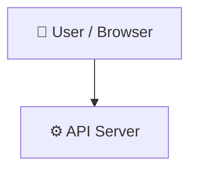

# Cognizant_DeepSkilling_Solutions

> A repository created for the Java FSE Mandatory hands-on related to Cognizant Digital Nurture 5.0

## 📑 Table of Contents

- [Description](#description)
- [Key Features](#key-features)
- [Use Cases](#use-cases)
- [Tech Stack](#tech-stack)
- [Architecture](#architecture)
- [Quick Start](#quick-start)
- [Key Dependencies](#key-dependencies)
- [API Endpoints](#api-endpoints)
- [Project Structure](#project-structure)
- [Development Setup](#development-setup)
- [Contributors](#contributors)
- [Contributing](#contributing)
- [License](#license)

## 📝 Description

Cognizant_DeepSkilling_Solutions is a structured learning repository designed to guide developers through core backend and frontend engineering concepts. The codebase is organized as a multi-week training curriculum, progressing from fundamental Java operations and database connectivity to complex enterprise microservices and modern single-page applications.

## ✨ Key Features

- **☕ Core Java and JDBC Examples** — Includes practical implementations for array manipulation, collections like ArrayList, and basic JDBC database connectivity setups.
- **🍃 Spring Boot REST Framework** — Contains starter templates configured with spring-boot-starter-web, actuator, and testing suites for microservice development.
- **⚛️ React and State Management** — Features a React application integrating Redux Toolkit, Redux Saga for side-effect management, and custom React context providers.
- **🎨 Web Styling Integration** — Provides basic frontend integration demonstrations featuring standard index.html and Bootstrap CSS configurations.

## 🎯 Use Cases

- Stepping through foundational Java programs, JDBC integrations, and database connection setups.
- Reference patterns for creating Spring Boot REST services with actuators and automated testing frameworks.
- Learning frontend state management architectural flows with React, Redux Toolkit, and asynchronous Saga middleware.

## 🛠️ Tech Stack

-ED8B00?style=for-the-badge&logo=openjdk&logoColor=white)  

## 🏗️ Architecture

A high-level view of how the main pieces fit together:



## ⚡ Quick Start

```bash

# 1. Clone the repository
git clone https://github.com/Kpaul-create/Cognizant_DeepSkilling_Solutions.git

# 2. Install dependencies
npm install

# 3. Start the dev server
npm run dev
```

## 📦 Key Dependencies

```
react-router-dom: ^7.18.1
spring-boot-starter-actuator: managed
spring-boot-starter-web: managed
spring-boot-starter-test: managed
```

## 🌐 API Endpoints

Detected endpoints (best-effort scan):

```
GET env
GET /
```

## 📁 Project Structure

```
.
├── .mvn
│   └── wrapper
│       ├── maven-wrapper.jar
│       └── maven-wrapper.properties
├── DeepSkill_Week 2,3,4
│   ├── Spring Rest Practice
│   │   └── demo
│   │       ├── .mvn
│   │       │   └── wrapper
│   │       │       └── ...
│   │       ├── mvnw
│   │       ├── mvnw.cmd
│   │       ├── pom.xml
│   │       └── src
│   │           ├── main
│   │           │   └── ...
│   │           └── test
│   │               └── ...
│   ├── W2-PLSQL
│   │   ├── Control Structure
│   │   │   ├── SCENARIO_1_OUTPUT.jpg
│   │   │   ├── SCENARIO_2_OUTPUT.jpg
│   │   │   ├── SCENARIO_3_OUTPUT.jpg
│   │   │   ├── Scenario_1.sql
│   │   │   ├── Scenario_2.sql
│   │   │   └── Scenario_3.sql
│   │   └── Strored Procedure
│   │       ├── Type_1.sql
│   │       ├── Type_1_OUTPUT.jpg
│   │       ├── Type_2.sql
│   │       ├── Type_2_OUTPUT.jpg
│   │       ├── Type_3.sql
│   │       └── Type_3_OUTPUT.jpg
│   ├── W2_ JUnit Basic Testing
│   │   ├── Assertions Junit
│   │   │   ├── AssertionsTest.java
│   │   │   └── AssertionsTest_OUTPUT.jpg
│   │   └── Setup JUnit
│   │       ├── CalculatorTest.java
│   │       ├── CalculatorTest_OUTPUTjpg
│   │       ├── Sample_test_Calculator.java
│   │       ├── Setting_up_JUnit.iml
│   │       └── xml
│   ├── W3_Spring Core, Maven
│   │   ├── Configuring Basic Spring Application
│   │   │   ├── Book.java
│   │   │   ├── BookController.java
│   │   │   ├── BookRepository.java
│   │   │   ├── LibraryManagementApplication.java
│   │   │   ├── applications.properties
│   │   │   ├── pom.xml
│   │   │   └── target
│   │   │       ├── LibraryManagement-1.0.0.jar
│   │   │       └── maven-archiver
│   │   │           └── ...
│   │   ├── Configuring the Spring IoC Container
│   │   │   ├── BookRepository.java
│   │   │   ├── BookService.java
│   │   │   ├── MainApp.java
│   │   │   └── applicationContext.xml
│   │   ├── Creating & Configuring a Maven Project
│   │   │   ├── pom.xml
│   │   │   └── target
│   │   │       ├── LibraryManagement-1.0-SNAPSHOT.jar
│   │   │       └── maven-archiver
│   │   │           └── ...
│   │   ├── Creating a Spring Boot Application
│   │   │   ├── Book.java
│   │   │   ├── BookController.java
│   │   │   ├── BookRepository.java
│   │   │   ├── LibraryManagementApplication.java
│   │   │   └── pom.xml
│   │   ├── Implementing Constructor & Setter Injection
│   │   │   ├── BookRepository.java
│   │   │   ├── BookService.java
│   │   │   ├── LibraryManagementApplication.java
│   │   │   └── applicationContext.xml
│   │   └── Implementing Dependency Injection
│   │       ├── BookRepository.java
│   │       ├── BookService.java
│   │       ├── LibraryManagementApplication.java
│   │       └── applicationContext.xml
│   ├── W3_Spring Data JPA
│   │   ├── Add a new country
│   │   │   ├── Body.txt
│   │   │   ├── Get_all_country.txt
│   │   │   ├── POST_request.txt
│   │   │   └── test terminal.txt
│   │   ├── Demonstrate implementation of OR Mapping
│   │   │   ├── CityEntity.java
│   │   │   ├── Country.java
│   │   │   ├── CountryController.java
│   │   │   ├── CountryRepository.java
│   │   │   └── CountryService.java
│   │   ├── Demonstrate implementation of Query Methods feature of Spring Data JPA
│   │   │   ├── UserController.java
│   │   │   ├── UserRepository.java
│   │   │   ├── application.properties
│   │   │   ├── pom.xml
│   │   │   └── target
│   │   │       ├── maven-archiver
│   │   │       │   └── ...
│   │   │       └── spring-data-jpa-quick-1.0.0.jar
│   │   ├── Difference between JPA, Hibernate and Spring Data JPA
│   │   │   ├── Hibernate.txt
│   │   │   ├── JPA (Java Persistence API).txt
│   │   │   └── Spring Data JPA.txt
│   │   ├── Find a country based on country code
│   │   │   ├── CountryController.java
│   │   │   ├── CountryRepository.java
│   │   │   ├── CountryService.java
│   │   │   └── Countryupdate.java
│   │   ├── Implement services for managing Country
│   │   │   ├── Country.java
│   │   │   ├── CountryController.java
│   │   │   ├── CountryRepo.java
│   │   │   └── CountryService.java
│   │   └── Spring Data JPA - Quick Example
│   │       └── SpringDataJpaQuickApplication.java
│   └── W4_Spring REST using Spring Boot 3
│       ├── Create a Spring Web Project using Maven
│       │   ├── Build command
│       │   ├── HelloController.java
│       │   ├── SpringLearnApplication.java
│       │   ├── SpringLearnApplicationTests.java
│       │   ├── application.properties
│       │   ├── pom.xml
│       │   └── target
│       │       ├── maven-archiver
│       │       │   └── ...
│       │       ├── spring-learn-0.0.1-SNAPSHOT.jar
│       │       └── spring-learn-0.0.1-SNAPSHOT.jar.original
│       ├── Create authentication service that returns JWT
│       │   ├── AuthController.java
│       │   ├── JwtUtil.java
│       │   ├── SecurityConfig.java
│       │   ├── SpringLearnApplication.java
│       │   ├── Test
│       │   ├── application.properties
│       │   └── pom.xml
│       ├── Hello World RESTful Web Service
│       │   ├── HelloController.java
│       │   ├── Set port
│       │   ├── SpringLearnApplication.java
│       │   └── output
│       ├── REST - Country Web Service
│       │   ├── Country.java
│       │   ├── CountryController.java
│       │   ├── Test
│       │   ├── application.properties
│       │   ├── country.xml
│       │   └── main.java
│       ├── REST - Get country based on country code
│       │   ├── CountryController.java
│       │   ├── CountryService.java
│       │   ├── CountryServiceImpl.java
│       │   ├── SpringLearnApplication.java
│       │   ├── Test
│       │   ├── application.properties
│       │   └── country.xml
│       └── Spring Core – Load Country from Spring Configuration XML
│           ├── SpringLearnApplication.java
│           ├── application.properties
│           ├── date-format.xml
│           └── run
├── React_SP,Week 6,7
│   ├── Skillspring_module
│   │   ├── DeveloperBios-API
│   │   │   └── DeveloperBios-API
│   │   │       ├── app.js
│   │   │       ├── break.txt
│   │   │       ├── developers.json
│   │   │       ├── models
│   │   │       │   └── ...
│   │   │       ├── package.json
│   │   │       ├── routes
│   │   │       │   └── ...
│   │   │       ├── schema.js
│   │   │       └── views
│   │   │           └── ...
│   │   ├── developer-bios
│   │   │   └── developer-bios
│   │   │       ├── break
│   │   │       ├── package.json
│   │   │       ├── public
│   │   │       │   └── ...
│   │   │       └── src
│   │   │           └── ...
│   │   ├── developer-bios tests-completed
│   │   │   └── developer-bios
│   │   │       ├── break
│   │   │       ├── package.json
│   │   │       ├── public
│   │   │       │   └── ...
│   │   │       └── src
│   │   │           └── ...
│   │   └── reakt
│   │       ├── eslint.config.mjs
│   │       ├── package.json
│   │       ├── public
│   │       │   ├── favicon.ico
│   │       │   ├── index.html
│   │       │   ├── logo192.png
│   │       │   ├── logo512.png
│   │       │   ├── manifest.json
│   │       │   └── robots.txt
│   │       └── src
│   │           ├── App.css
│   │           ├── App.js
│   │           ├── App.test.js
│   │           ├── AppDeveloper.js
│   │           ├── Developer.js
│   │           ├── DeveloperBios.js
│   │           ├── DisplayBios.js
│   │           ├── Home.css
│   │           ├── Home.js
│   │           ├── index.css
│   │           ├── index.js
│   │           ├── logo.svg
│   │           ├── reportWebVitals.js
│   │           └── setupTests.js
│   ├── Week 6  React
│   │   ├── 1. ReactJS-HOL
│   │   │   ├── Navigate
│   │   │   ├── create-react-app
│   │   │   ├── development server
│   │   │   ├── myfirstreact
│   │   │   └── src
│   │   │       └── App.js
│   │   ├── 2. ReactJS-HOL
│   │   │   ├── App.js
│   │   │   ├── Components
│   │   │   │   ├── About.js
│   │   │   │   ├── Contact.js
│   │   │   │   └── Home.js
│   │   │   ├── StudentApp
│   │   │   └── project folder
│   │   ├── 3. ReactJS-HOL
│   │   │   ├── Components
│   │   │   │   ├── App.js
│   │   │   │   └── CalculateScore.js
│   │   │   ├── project folder
│   │   │   └── scorecalculatorapp
│   │   ├── 34 ReactJS-HOL
│   │   │   ├── Components
│   │   │   │   ├── App.js
│   │   │   │   ├── Post.js
│   │   │   │   └── Posts.js
│   │   │   ├── blogapp
│   │   │   └── project folder
│   │   ├── 5. ReactJS-HOL
│   │   │   ├── CohortDetails.module.css
│   │   │   ├── Component
│   │   │   └── Import the CSS Module
│   │   ├── 6. ReactJS-HOL
│   │   │   ├── App.js
│   │   │   ├── React App
│   │   │   ├── Router DOM
│   │   │   └── src
│   │   │       ├── Home.js
│   │   │       ├── TrainerDetails.js
│   │   │       ├── TrainersList.js
│   │   │       ├── TrainersMock.js
│   │   │       └── trainer.js
│   │   ├── 7. ReactJS-HOL
│   │   │   ├── Output
│   │   │   ├── React App
│   │   │   └── src
│   │   │       ├── App.js
│   │   │       ├── Cart.js
│   │   │       └── OnlineShopping.js
│   │   └── 8. ReactJS-HOL
│   │       ├── Output
│   │       ├── React App
│   │       └── src
│   │           ├── App.js
│   │           └── CountPeople.js
│   └── Week 7 React
│       ├── 10. ReactJS-HOL
│       │   ├── Create React App
│       │   └── src
│       │       └── App.js
│       ├── 11. ReactJS-HOL
│       │   ├── Create React App
│       │   └── src
│       │       ├── App.js
│       │       └── CurrencyConvertor.js
│       ├── 12. ReactJS-HOL
│       │   ├── Create React App
│       │   └── src
│       │       ├── App.js
│       │       ├── Guest.js
│       │       └── User.js
│       ├── 13. ReactJS-HOL
│       │   ├── Create React App
│       │   └── src
│       │       ├── App.js
│       │       ├── BlogDetails.js
│       │       ├── BookDetails.js
│       │       └── CourseDetails.js
│       ├── 14. ReactJS-HOL
│       │   ├── Create React App
│       │   └── src
│       │       ├── App.js
│       │       ├── EmployeeCard.js
│       │       ├── EmployeesList.js
│       │       └── ThemeContext.js
│       ├── 15. ReactJS-HOL
│       │   ├── Create React App
│       │   └── src
│       │       ├── App.js
│       │       └── ComplaintRegister.js
│       ├── 16. ReactJS-HOL
│       │   ├── Create React App
│       │   └── src
│       │       ├── App.js
│       │       └── Register.js
│       ├── 17. ReactJS-HOL
│       │   ├── Create React App
│       │   └── src
│       │       ├── App.js
│       │       └── Getuser.js
│       └── 9. ReactJS-HOL
│           ├── Create React App
│           └── src
│               ├── App.js
│               ├── IndianPlayers.js
│               └── ListofPlayers.js
├── Upskill_Week 1
│   ├── Week 1 Algorithms_Data Structures
│   │   └── Ex-2 E-commerce Search
│   │       ├── ECommerceSearch.java
│   │       ├── EcommerceSearch_output.jpg
│   │       ├── code
│   │       │   ├── ECommerceSearch.java
│   │       │   └── Product.java
│   │       └── output
│   │           └── Pasted image.png
│   ├── Week 1 Design principles & Patterns
│   │   ├── DocumentFactoryTest.java
│   │   ├── Factory design Document Output.jpg
│   │   ├── Single.java
│   │   └── Singleton Logger output.jpg
│   ├── bootstrap-demo.html
│   ├── index.html
│   ├── java
│   │   ├── ArrayListExample.java
│   │   ├── ArraySumAndAverage.java
│   │   ├── BasicJDBCConnection.java
│   │   ├── ClassAndObjectCreation.java
│   │   ├── CustomException.java
│   │   ├── DataTypeDemonstration.java
│   │   ├── DecompileNote.java
│   │   ├── EvenOrOddChecker.java
│   │   ├── ExecutorServiceExample.java
│   │   ├── FactorialCalculator.java
│   │   ├── FileReading.java
│   │   ├── FileWriting.java
│   │   ├── GradeCalculator.java
│   │   ├── HashMapExample.java
│   │   ├── HelloWorld.java
│   │   ├── HttpClientApiExample.java
│   │   ├── InheritanceExample.java
│   │   ├── InsertUpdateJdbc.java
│   │   ├── InterfaceImplementation.java
│   │   ├── JavapInstructions.java
│   │   ├── LambdaExpressions.java
│   │   ├── LeapYearChecker.java
│   │   ├── MethodOverloading.java
│   │   ├── ModuleSystemExample.java
│   │   ├── MultiplicationTable.java
│   │   ├── NumberGuessingGame.java
│   │   ├── OperatorPrecedence.java
│   │   ├── PalindromeChecker.java
│   │   ├── PatternMatchingExample.java
│   │   ├── RecordsExample.java
│   │   ├── RecursiveFibonacci.java
│   │   ├── ReflectionExample.java
│   │   ├── SimpleCalculator.java
│   │   ├── StreamAPIExample.java
│   │   ├── StringReversal.java
│   │   ├── TCPClient.java
│   │   ├── TCPServer.java
│   │   ├── ThreadCreation.java
│   │   ├── TransactionHandlingJdbc.java
│   │   ├── TryCatchExample.java
│   │   ├── TypeCastingExample.java
│   │   └── VirtualThreadsExample.java
│   ├── main.js
│   └── styles.css
├── Week 5 Microservices
│   ├── Microservices with API gateway
│   │   └── Create Eureka Discovery Server and register
│   │       ├── Register a Microservice
│   │       │   ├── Dependencies.xml
│   │       │   ├── Main Class.java
│   │       │   └── application.yml
│   │       ├── Run Test.txt
│   │       └── eureka-server
│   │           ├── Main Class.java
│   │           ├── application.yml
│   │           ├── dependencyManagement.xml
│   │           └── pom.xml
│   └── Microservices with Spring Boot 3 an Spring Cloud
│       ├── Build a User and Order Management System
│       │   ├── MainApp.java
│       │   ├── Order.java
│       │   ├── OrderController.java
│       │   ├── OrderRepository.java
│       │   ├── User.java
│       │   ├── UserClient.java
│       │   ├── UserController.java
│       │   └── application.properties
│       ├── Implement an API Gateway
│       │   ├── Config Repo
│       │   │   ├── inventory-service.yml
│       │   │   └── product-service.yml
│       │   ├── Dependencies.xml
│       │   ├── Eureka Server
│       │   │   ├── Dependencies.xml
│       │   │   ├── Main Class.java
│       │   │   └── application.yml
│       │   ├── Inventory Service
│       │   │   ├── Inventory.java
│       │   │   ├── InventoryController.java
│       │   │   ├── InventoryRepository.java
│       │   │   └── bootstrap.yml
│       │   ├── Main Class,java
│       │   ├── Product Service
│       │   │   ├── Dependencies.xml
│       │   │   ├── Product.java
│       │   │   ├── ProductController.java
│       │   │   ├── ProductRepository.java
│       │   │   └── bootstrap.yml
│       │   └── application.yml
│       └── Inventory Management System with Service Discovery
│           ├── Enable Rate Limiting.java
│           ├── Example Requests.txt
│           ├── application.yml
│           └── pom.xml
├── Week 8 GIT
│   ├── 1. Git-HOL
│   │   ├── Add a File to a Repository.txt
│   │   ├── Configure Git.txt
│   │   └── Set Notepad++ as Git Editor.txt
│   ├── 2. Git-HOL
│   │   ├── Add Remaining Files and Commit.txt
│   │   ├── Check Git Status.txt
│   │   ├── Create Files or Folders to Ignore.txt
│   │   ├── Create a .gitignore File.txt
│   │   └── Create a Local Git Repository.txt
│   ├── 3. Git-HOL
│   │   ├── Branching Instructions.txt
│   │   ├── Make changes.txt
│   │   ├── Merge steps.txt
│   │   └── Prerequisites.txt
│   ├── 4. Git-HOL
│   │   ├── Cleanup and Ignore Merge Backup Files.txt
│   │   ├── Create Conflicting File in Master.txt
│   │   ├── Create GitWork Branch and Add File.txt
│   │   ├── Delete Branch and View Final Log.txt
│   │   ├── Finalize the Merge.txt
│   │   ├── Merge and Resolve Conflict.txt
│   │   ├── Prerequisites.txt
│   │   ├── Use 3-Way Merge Tool (P4Merge).txt
│   │   └── View History and Differences.txt
│   └── 5. Git-HOL
│       ├── List all available branches.txt
│       ├── Prerequisites.txt
│       ├── Pull latest changes from remote.txt
│       ├── Push pending local commits to remote.txt
│       └── Verify master branch is clean.txt
└── package.json
```

## 🛠️ Development Setup

### Node.js / JavaScript
1. Install Node.js (v18+ recommended)
2. Install dependencies: `npm install` (or `yarn` / `pnpm install` / `bun install`)
3. Start the dev server: see the **Quick Start** above
